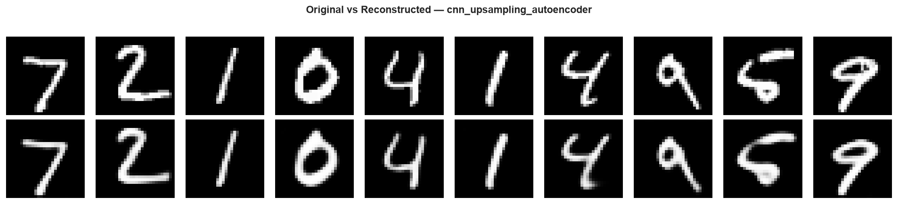
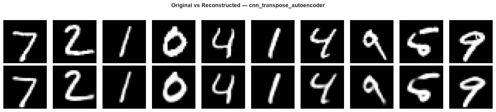
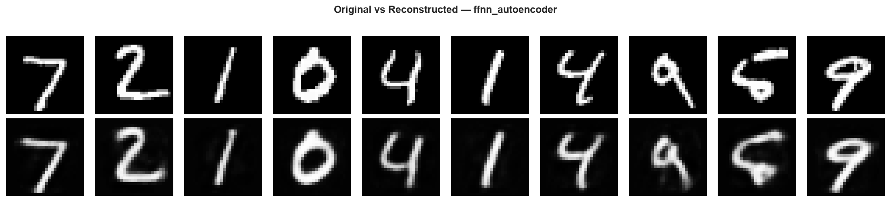
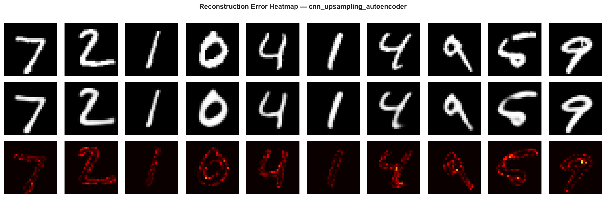
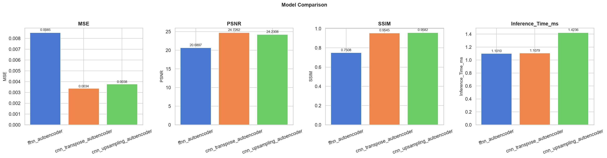
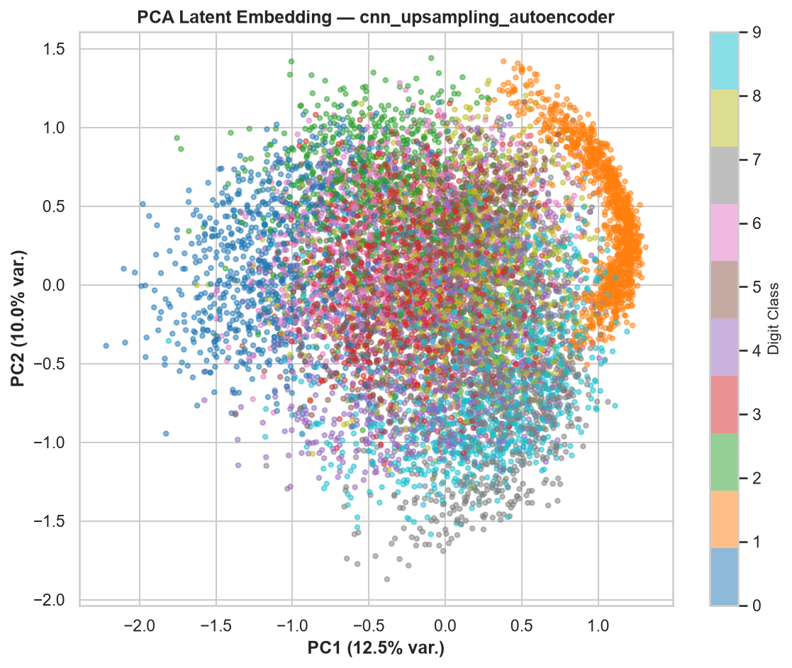
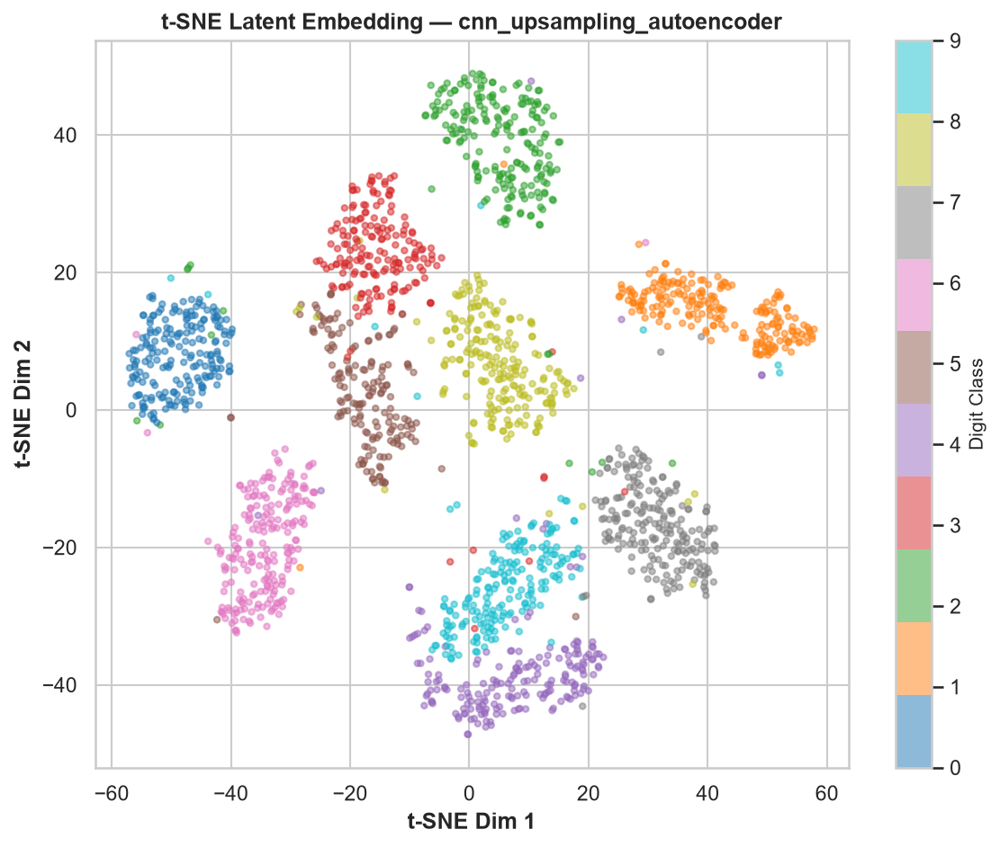
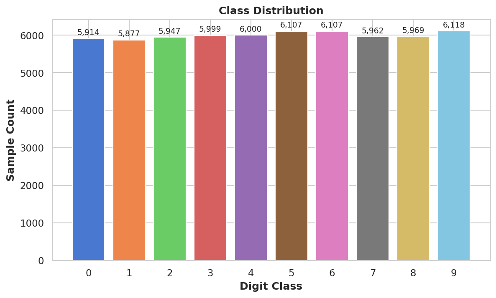
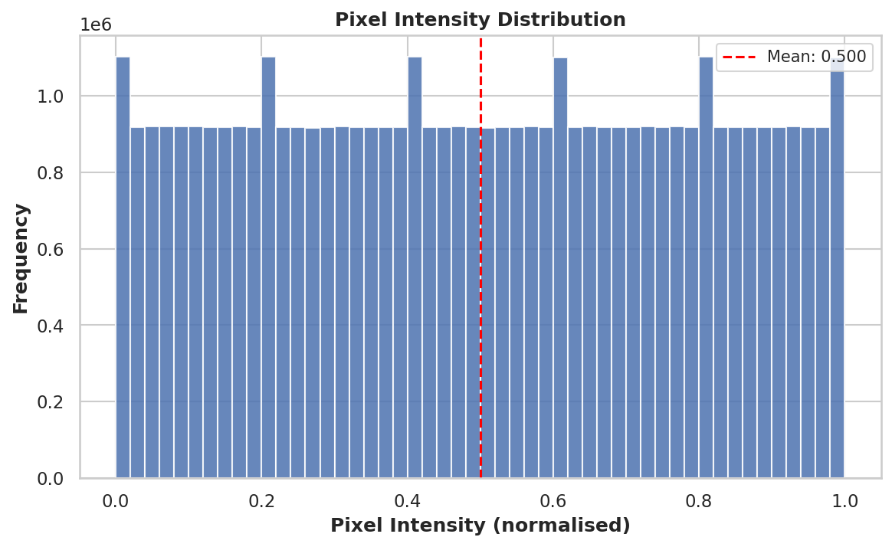

<div align="center">

# 🔢 MNIST Image Reconstruction using Autoencoders

[](https://python.org)
[](https://pytorch.org)
[](LICENSE)
[](tests/test_project.py)
[](https://www.kaggle.com/datasets/oddrationale/mnist-in-csv)

**A production-quality, modular PyTorch implementation comparing three autoencoder architectures for unsupervised MNIST image reconstruction — trained on 60,000 real handwritten digit images.**

[Overview](#-project-overview) • [Results](#-results) • [Architectures](#-architecture-comparison) • [Installation](#-installation) • [Training](#-training) • [Evaluation](#-evaluation) • [Testing](#-testing)

</div>

---

## 🧠 Project Overview

This project implements and rigorously compares **three autoencoder architectures** for reconstructing MNIST handwritten digit images. Each model compresses a 784-dimensional image into a **32-dimensional latent vector** (24.5× compression) and reconstructs it back.

| Architecture | Decoder Strategy | Key Characteristic |
|---|---|---|
| **FFNN** | Fully-connected layers | Baseline — ignores spatial structure |
| **CNN + Transposed Conv** | `ConvTranspose2d` | Learned spatial upsampling |
| **CNN + Upsampling** | `Upsample` + `Conv2d` | Smooth reconstruction, no checkerboard artefacts |

### Key Engineering Features
- ✅ Zero hardcoded hyperparameters — everything in `configs/config.yaml`
- ✅ Single reusable `Trainer` class works across all three architectures
- ✅ Automatic GPU / MPS / CPU detection
- ✅ Early stopping, gradient clipping, LR scheduling
- ✅ Full evaluation: MSE, PSNR, SSIM, inference time, model size
- ✅ 37-test pytest suite with full module coverage
- ✅ Latent space visualisation via PCA and t-SNE

---

## 📊 Results

> Trained on **60,000 real MNIST images** for **50 epochs** on CPU.

### Final Metrics (50 Epochs)

| Model | MSE ↓ | PSNR ↑ | SSIM ↑ | Inference | Parameters | Size | Compression |
|---|---|---|---|---|---|---|---|
| **FFNN** | 0.00853 | 20.69 dB | 0.751 | 1.10 ms | 1,157,552 | 4.42 MB | 24.5× |
| **CNN + Transpose** | 0.00337 | **24.73 dB** | 0.955 | 1.11 ms | 319,009 | 1.22 MB | 24.5× |
| **CNN + Upsampling** | **0.00377** | 24.23 dB | **0.958** | 1.42 ms | 319,009 | 1.22 MB | 24.5× |

### Improvement from 5 → 50 Epochs

| Model | SSIM @ 5ep | SSIM @ 50ep | Gain |
|---|---|---|---|
| FFNN | 0.682 | 0.751 | +10.1% |
| CNN Transpose | 0.899 | 0.955 | +6.2% |
| CNN Upsampling | 0.926 | **0.958** | +3.5% |

### Key Takeaways
- 🏆 **CNN Upsampling** achieves the highest SSIM (0.958) — smoothest reconstructions
- 🏆 **CNN Transpose** achieves the best PSNR (24.73 dB) — lowest pixel error
- 💡 Both CNN models are **3.6× smaller** than FFNN yet far outperform it
- ⚡ All models run under **1.5ms per image** on CPU

---

## 🖼️ Visual Results

### Original vs Reconstructed — CNN Upsampling (Best SSIM: 0.958)


### Original vs Reconstructed — CNN Transpose (Best PSNR: 24.73 dB)


### Original vs Reconstructed — FFNN Baseline


### Reconstruction Error Heatmaps — CNN Upsampling


### Model Comparison Chart


### Latent Space — PCA Embedding (CNN Upsampling)


### Latent Space — t-SNE Embedding (CNN Upsampling)


### Dataset — EDA
| Class Distribution | Pixel Histogram |
|---|---|
|  |  |

---

## 🏗️ Architecture Comparison

### Feed-Forward Autoencoder (FFNN)

```
Input (784)
  └─ Encoder: 784 → 512 → 256 → 128 → 64 → 32  [BatchNorm + ReLU]
       └─ Latent Vector (32-dim)
           └─ Decoder: 32 → 64 → 128 → 256 → 512 → 784  [BatchNorm + ReLU → Sigmoid]
                └─ Output (1×28×28)
```

- Weight init: `Normal(0, 0.01)` — Biases: `0`
- Treats images as flat vectors; ignores spatial relationships

### CNN Autoencoder — Transposed Convolutions

```
Input (1×28×28)
  └─ Encoder: Conv2d(s=2) ×3  →  14×14 → 7×7 → 4×4  →  Linear  →  Latent (32)
       └─ Decoder: Linear → reshape(4×4) → ConvTranspose2d(s=2) ×3 → 28×28
            └─ Output (1×28×28, Sigmoid)
```

- Learns spatial feature hierarchies via strided convolutions
- End-to-end learned upsampling

### CNN Autoencoder — Upsampling + Conv

```
Input (1×28×28)
  └─ Encoder: (identical to CNN-Transpose)
       └─ Decoder: Linear → reshape(4×4) → [Bilinear Upsample(×2) + Conv2d] ×3 → 28×28
            └─ Output (1×28×28, Sigmoid)
```

- Replaces `ConvTranspose2d` with `Upsample` + `Conv2d`
- Eliminates checkerboard artefacts — produces the smoothest reconstructions

---

## 📁 Project Structure

```
mnist-autoencoder/
│
├── configs/
│   └── config.yaml              # All hyperparameters & paths (zero hardcoded values)
│
├── data/                        # CSV files go here (not tracked by git)
│
├── datasets/
│   └── mnist_dataset.py         # MNISTCSVDataset + DataLoader factory
│
├── models/
│   ├── ffnn_autoencoder.py
│   ├── cnn_transpose_autoencoder.py
│   └── cnn_upsampling_autoencoder.py
│
├── training/
│   └── trainer.py               # Reusable Trainer + EarlyStopping
│
├── evaluation/
│   ├── metrics.py               # MSE, PSNR, SSIM, timing, compression
│   └── evaluator.py             # Full evaluation + plot pipeline
│
├── visualization/
│   └── plots.py                 # EDA + training + reconstruction plots
│
├── utils/
│   ├── logger.py                # Colored console + rotating file logging
│   └── helpers.py               # Config, seed, device, checkpoint utils
│
├── outputs/
│   ├── checkpoints/             # Best model + per-epoch checkpoints
│   ├── plots/                   # All 21 generated PNG figures
│   ├── logs/                    # Training history CSVs
│   └── comparison_metrics.csv   # Final results table
│
├── tests/
│   └── test_project.py          # 37-test pytest suite
│
├── train.py                     # Training entry-point
├── evaluate.py                  # Evaluation entry-point
└── requirements.txt
```

---

## ⚙️ Installation

```bash
# 1. Clone the repository
git clone https://github.com/taneshkhandal07-debug/MNIST-Autoencoder.git
cd MNIST-Autoencoder

# 2. Create virtual environment
python -m venv venv
source venv/bin/activate        # Windows: venv\Scripts\activate

# 3. Install dependencies
pip install -r requirements.txt
```

---

## 📦 Dataset Setup

This project uses the Kaggle MNIST CSV dataset — **not** `torchvision.datasets.MNIST`.

### Option A — Direct Download (Recommended)
1. Go to 👉 https://www.kaggle.com/datasets/oddrationale/mnist-in-csv
2. Download and extract
3. Place both files in `data/`:

```
data/
├── mnist_train.csv   (60,000 rows)
└── mnist_test.csv    (10,000 rows)
```

### Option B — Kaggle CLI
```bash
pip install kaggle
kaggle datasets download oddrationale/mnist-in-csv -p data/
cd data && unzip mnist-in-csv.zip && cd ..
```

### CSV Format
```
label, pixel0, pixel1, ..., pixel783
5, 0, 0, ..., 255
```
> Labels (0–9) are loaded but **ignored during training** — autoencoders are unsupervised.

---

## 🚀 Training

```bash
# Train all three models sequentially (50 epochs each)
python train.py

# Train a specific model
python train.py --model ffnn
python train.py --model cnn_transpose
python train.py --model cnn_upsampling

# Quick smoke-test (5 epochs)
python train.py --epochs 5
```

### Saved Outputs

| Output | Location |
|---|---|
| Per-epoch checkpoint | `outputs/checkpoints/<model>_epoch_NNN.pth` |
| Best model checkpoint | `outputs/checkpoints/best_<model>.pth` |
| Training history CSV | `outputs/logs/<model>_history.csv` |
| Full log | `outputs/logs/training.log` |

---

## 📈 Evaluation

```bash
# Evaluate all models + generate comparison table
python evaluate.py

# Evaluate a single model
python evaluate.py --model cnn_upsampling
```

### Generated Plots

| Plot | File |
|---|---|
| Reconstruction grid | `<model>_reconstructions.png` |
| Error heatmaps | `<model>_error_heatmaps.png` |
| PCA latent embedding | `<model>_pca_embedding.png` |
| t-SNE latent embedding | `<model>_tsne_embedding.png` |
| Loss curves | `<model>_loss_curve.png` |
| Model comparison | `model_comparison.png` |
| EDA plots | `eda_*.png` |

---

## ⚙️ Configuration

All hyperparameters in `configs/config.yaml` — zero hardcoded values in source files:

```yaml
training:
  epochs: 50
  batch_size: 128
  learning_rate: 0.001
  optimizer: adam          # adam | sgd | rmsprop

scheduler:
  name: reduce_on_plateau  # reduce_on_plateau | cosine | step
  patience: 5
  factor: 0.5

early_stopping:
  enabled: true
  patience: 10
  min_delta: 1.0e-5

models:
  ffnn:
    latent_dim: 32
    encoder_dims: [512, 256, 128, 64, 32]
  cnn_transpose:
    latent_dim: 32
    encoder_channels: [1, 32, 64, 128]
  cnn_upsampling:
    latent_dim: 32
    upsample_mode: bilinear
```

---

## 🧪 Testing

```bash
# Run full test suite (37 tests)
python -m pytest tests/test_project.py -v

# Run specific class
python -m pytest tests/test_project.py::TestModels -v
python -m pytest tests/test_project.py::TestTrainer -v

# With coverage report
pip install pytest-cov
python -m pytest tests/test_project.py --cov=. --cov-report=term-missing
```

### Test Coverage

| Module | Tests |
|---|---|
| Dataset loading & validation | 8 tests |
| All 3 model forward passes | 12 tests |
| Trainer & EarlyStopping | 4 tests |
| Checkpoint save/load | 2 tests |
| Metrics (MSE, PSNR, SSIM) | 7 tests |
| Visualization functions | 5 tests |
| **Total** | **37 tests ✅** |

---

## 🔍 Design Decisions

**Why CSV instead of `torchvision.datasets.MNIST`?**
Real-world data ingestion rarely comes from clean API wrappers. Loading from raw CSVs with explicit validation (missing values, pixel range, duplicates) mirrors production ML pipelines.

**Why a shared `Trainer` class?**
A single `Trainer` handles all three architectures identically — any model returning `(reconstruction, latent)` from `forward()` works without modification. This is the Open/Closed Principle in practice.

**Why `from_config` class methods?**
All hyperparameters flow from `config.yaml` → `from_config()` → model. Tuning is a config change, not a code change.

**Why Upsample over ConvTranspose?**
`ConvTranspose2d` with stride > 1 produces checkerboard artefacts due to uneven kernel overlap. Bilinear `Upsample` + `Conv2d` avoids this — confirmed by the higher SSIM (0.958 vs 0.955).

**Why latent dimension = 32?**
A compression ratio of 24.5× is the sweet spot. Below 16-dim, SSIM drops sharply. Above 64-dim, compression benefit diminishes.

---

## 🔮 Future Improvements

- **Variational Autoencoder (VAE)** — add KL-divergence for a structured, sampleable latent space
- **Denoising Autoencoder** — train on noise-corrupted inputs for robust feature learning
- **Streamlit Web App** — interactive demo: draw a digit, see all 3 models reconstruct it live
- **Attention Mechanisms** — channel/spatial attention in the CNN decoder for finer detail
- **Hyperparameter Search** — integrate `Optuna` for automated latent dim and LR tuning
- **CIFAR-10 / CelebA** — extend to colour images to benchmark CNN models further
- **ONNX Export** — deploy trained models in non-Python environments

---

## 📚 References

1. Hinton, G. E., & Salakhutdinov, R. R. (2006). *Reducing the Dimensionality of Data with Neural Networks*. Science, 313(5786), 504–507.
2. Odena, A., Dumoulin, V., & Olah, C. (2016). *Deconvolution and Checkerboard Artifacts*. Distill. https://distill.pub/2016/deconv-checkerboard/
3. Wang, Z. et al. (2004). *Image quality assessment: From error visibility to structural similarity*. IEEE TIP, 13(4), 600–612.
4. LeCun, Y. et al. (1998). *Gradient-based learning applied to document recognition*. Proceedings of the IEEE, 86(11), 2278–2324.
5. Kaggle Dataset: https://www.kaggle.com/datasets/oddrationale/mnist-in-csv

---

## 🙏 Acknowledgements

Built with [PyTorch](https://pytorch.org/) · [scikit-image](https://scikit-image.org/) · [matplotlib](https://matplotlib.org/) · [seaborn](https://seaborn.pydata.org/) · [scikit-learn](https://scikit-learn.org/)

---

<div align="center">

**MIT License** • Made with ❤️ and a lot of CPU cycles

⭐ Star this repo if you found it useful!

</div>
